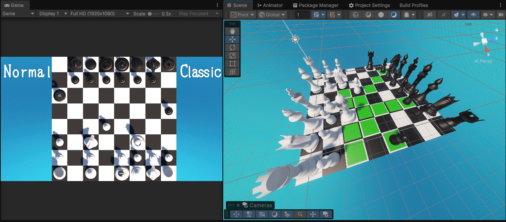

# First-Person Chess Simulator (一人称チェス)

## 概要
全世界で人気のあるボードゲームのチェスをモチーフにしたゲームです  
プレイヤーが操作するのは、チェスの駒ですが自駒の移動範囲内でしかプレイヤーは盤面を見ることが出来ません  
旧作の一人称チェスを作り直しました  
-> 以前のGithub URL: https://github.com/ho6ho6/ho66Games_FPSChess  

## ゲーム画面
[一人称にした理由]
チェスという「俯瞰して考えるゲーム」を、
あえて盤面の中に入り込む体験に変えたかったからです 
一人称視点にすることで、
自分の駒しか見えない、あるいは見えづらい状況が生まれ 
その結果完全情報ゲームだったチェスが、
直感や位置関係を頼りに考えるゲームに変化すると思われます 
この視点変更によって
同じルールでもプレイヤーの思考や緊張感が
大きく変わることを体感できた点が、
一人称にした一番の理由です 

### ビルド/実行方法
FirstPersonChessSimulator.exe を実行する - UnityRoomにも投稿してあります  
UnityRoomのURLです  
https://unityroom.com/games/ho66games_fpschess  

## 設計と実装ポイント
- スクリプトを分けて役割を明確にして開発を行いやすくする努力をしました。
- ゲーム全体の雰囲気を損なわなく、プレイヤーの気を散らさないような音楽を作りました。

## 動作環境
Windows11

## 使用技術
- Unity        ゲーム製作
- Blender      モデリング
- MuseScore4   BGM製作

## 今後の改善案
- UIの華やかさ
